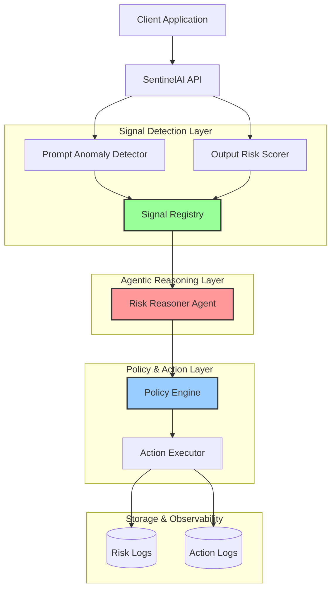

# Agentic Architecture Flow

## SentinelAI Agentic Risk Monitoring System

```mermaid
flowchart TD
    Client[Client Application]
    Sentinel[SentinelAI API]

    subgraph "Signal Detection Layer"
        PromptMon[Prompt Anomaly Detector]
        OutputMon[Output Risk Scorer]
        SignalReg[Signal Registry]
    end

    subgraph "Agentic Reasoning Layer"
        RiskReasoner[Risk Reasoner Agent]
    end

    subgraph "Policy & Action Layer"
        PolicyEngine[Policy Engine]
        ActionExecutor[Action Executor]
    end

    subgraph "Storage & Observability"
        RiskDB[(Risk Logs)]
        ActionDB[(Action Logs)]
    end

    %% Flow
    Client --> Sentinel
    Sentinel --> PromptMon
    Sentinel --> OutputMon

    PromptMon --> SignalReg
    OutputMon --> SignalReg

    SignalReg --> RiskReasoner
    RiskReasoner --> PolicyEngine
    PolicyEngine --> ActionExecutor

    ActionExecutor --> RiskDB
    ActionExecutor --> ActionDB

    %% Styling
    style SignalReg fill:#99ff99,stroke:#333,stroke-width:2px
    style RiskReasoner fill:#ff9999,stroke:#333,stroke-width:2px
    style PolicyEngine fill:#99ccff,stroke:#333,stroke-width:2px
```
