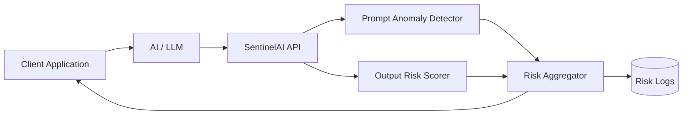

# SentinelAI Architecture (Draft)

SentinelAI sits between an application and an AI model, acting as an
observability and risk-detection layer.

### High-level flow
1. Application sends prompt and model output to SentinelAI
2. SentinelAI analyzes inputs and outputs using lightweight monitors
3. Risk signals are generated and aggregated
4. Results are logged and returned to the application
5. Flagged interactions can be reviewed via a dashboard

The system is designed to be model-agnostic and minimally invasive.

## High-Level Architecture

---

 
### Flow explanation

1. The client application sends prompt and model response to SentinelAI
2. Prompt anomaly detection checks for distribution shifts
3. Output risk scoring flags unsafe or unstable responses
4. Risk signals are aggregated into a unified score
5. Results are returned and optionally logged for review
 
---